# QRCodeGenerator

Aplicatie Android pentru a genera coduri QR. Un utilizator are posibilitatea de a isi crea un cont si de a salva codurile QR generate.

Efectueaza apeluri HTTP catre 3 servere:

1. Catre server-ul de inregistrare si autentificare. (`/register`, `/login`)
2. Catre server-ul ce genereaza codurile QR. (`http://api.qrserver.com/v1/create-qr-code/`)
3. Catre server-ul ce contine baza de date cu codurile QR pentru a le salva sau pentru a le primi pe cele salvate.(`/save`, `/codes`)

## Flow-ul aplicatiei

Primul ecran va da posibilitatea unui utilizator sa navigheze catre ecranul unde va crea un cod QR, sau sa isi creeze un cont. Daca utilizatorul are deja un cont creat, acesta se va putea loga.

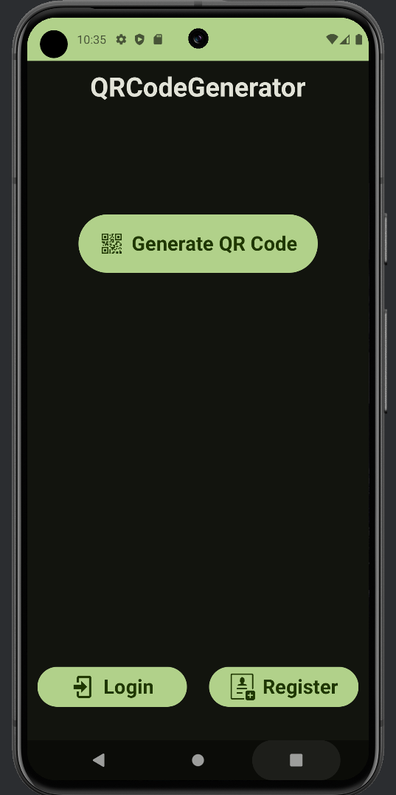 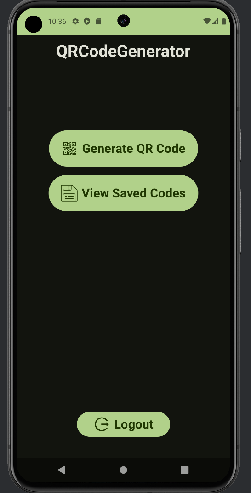

Ecranul de inregistrare da posibilitatea de a crea un cont folosing un username si o parola.

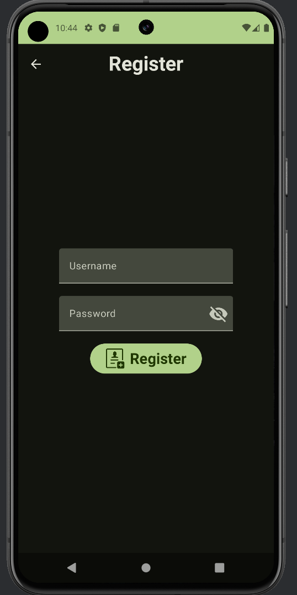 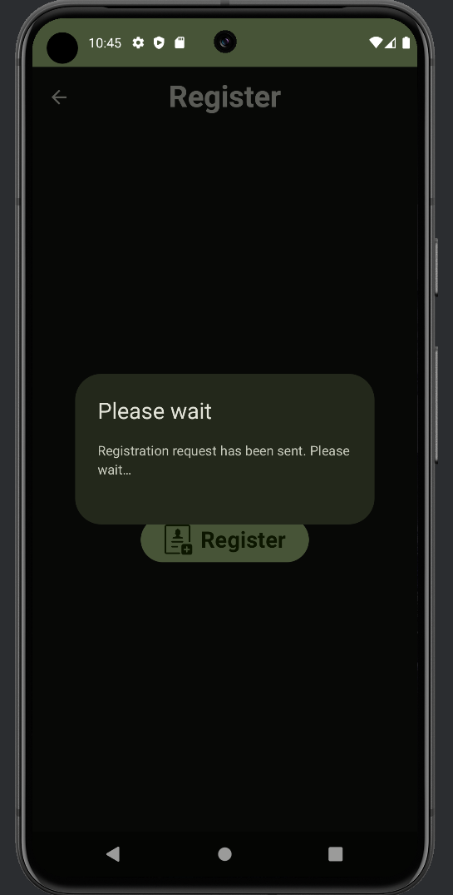 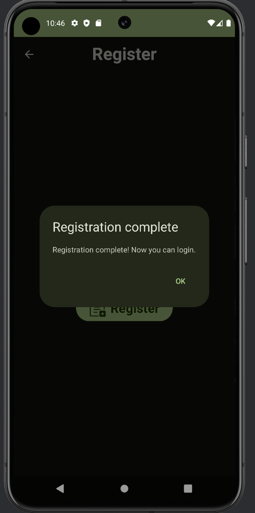

Ecranul pentru autentificare este asemanator.

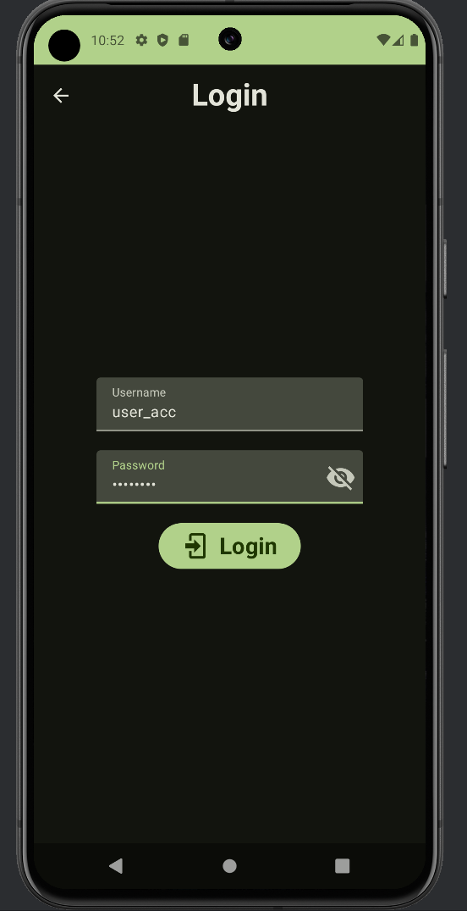 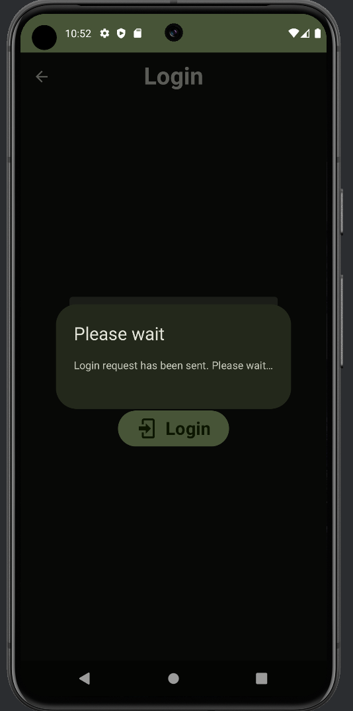 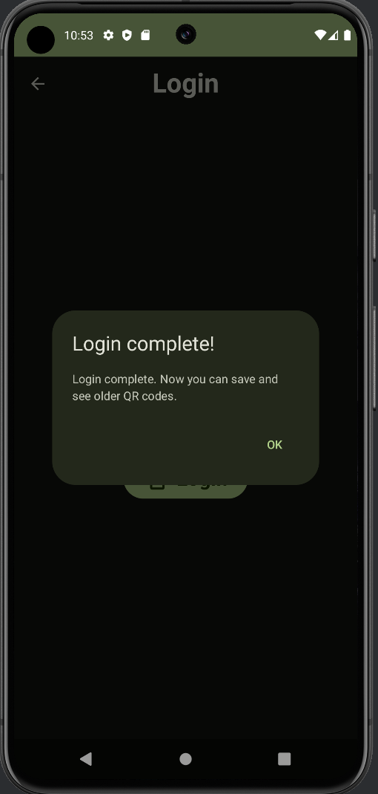

Ecranul ce permite construirea unui cod QR are un un camp pentru a specifica datele encodate in cod.
Contine un dropdown menu pentru optiuni aditionale (culoarea codului QR generat).

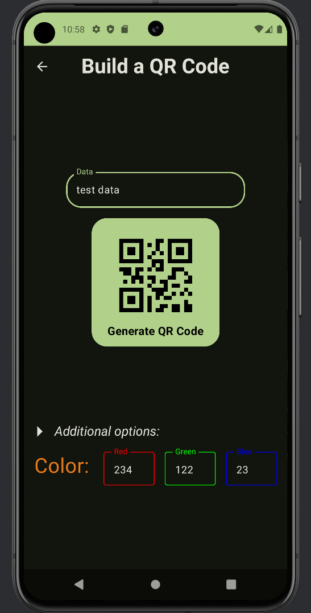 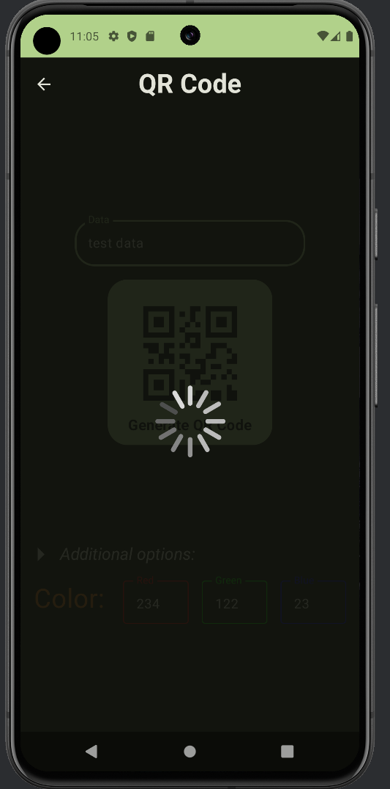
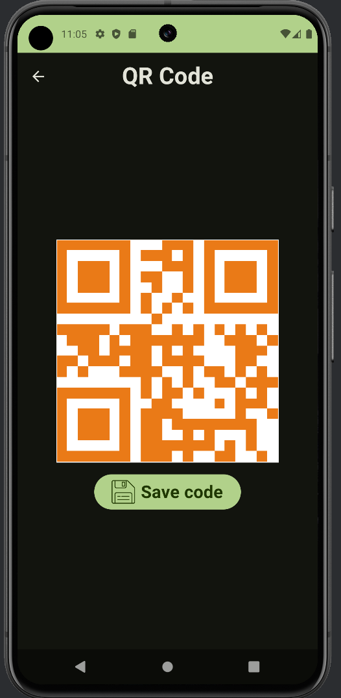 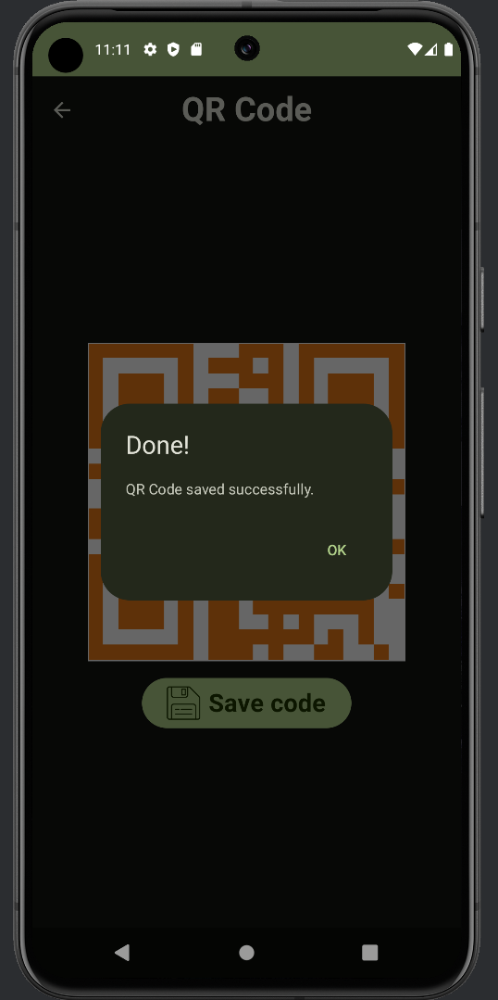

Utilizatorul va putea vedea toate codurile salvate. Le va putea vedea atat intr-o versiune rezumata, cat si
intr-o versiune extinsa.

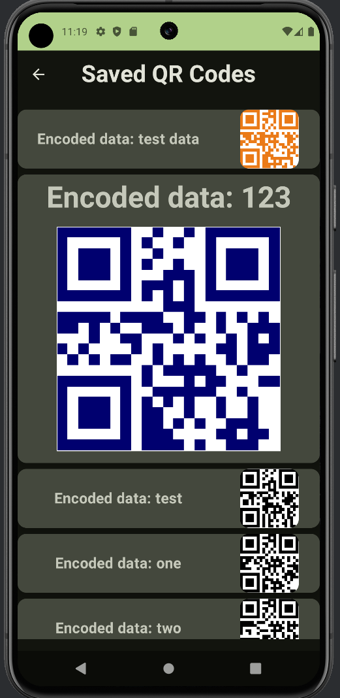 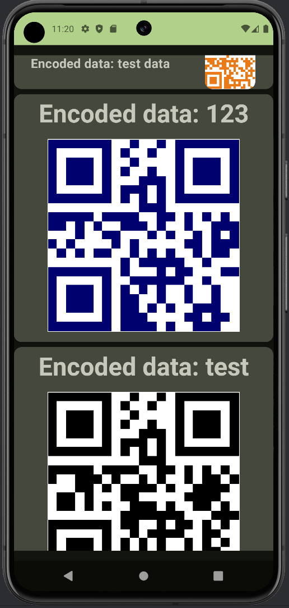
